# Best Practices for MLOps on Azure

In this document, we want to tell the best practises for MLOps on Azure from the experiences we had with working wiht enterprise organizations from differennt industrues on implemeting Machine Learning at scale. This document will cover the following topics:

* MLOps definition
* Templates (infra + resources)
* Dev tools and project management
* Choosing the right compute target
* Managing conda environments
* Data management (datasets)
* Data exploration and validation
* Data preparation
* Model development
* Model Validation
* Model management
* Pipeline development
* Model and pipeline deployment
* Monitoring

# MLOps Definition

There is a wide discussion on the official definition of MLOps. Mostly, when people talk about MLOps,
they talk about the automatic deployment of models, including model CI/CD. However, the MLOps definition is much more comprehensive. In this repo, the definition is defined as follows:

## MLOps is all the DevOps practices applied to the ML lifecycle, modified to the requirements of uncertainty in data and model exploration. ##

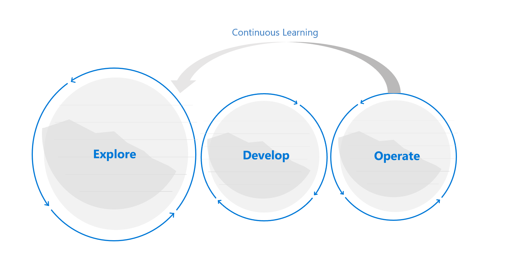

This picture explains the uncertainty that we get in Machine Learning due to data and model explorarion. Due to this uncertainty, we can not simply aply DevOps practices to the Machine Learning Lifecyle, but we need to adjust to fit the requiremnts that data science teams have when developing their models.

When we talk about the ML lifecycle, we talk about the four stages of: Business understanding, data
acquisition, modeling and deployment, explained in the following picture:

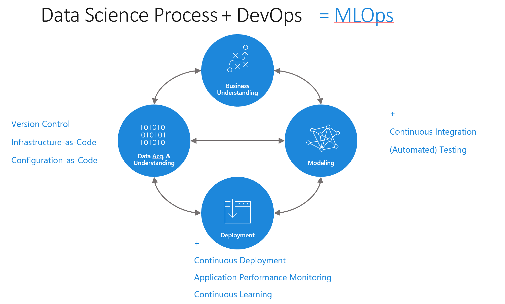

As you can see, this lifecycle is an iterative process between the different stages.

As we have explained, MLOps are the DevOps practices that wrap around this data science lifecycle. The
documentation is now mostly focused on model deployment, but there is way more that we can learn from software engineering, including:

* standardized infrastructure
* standardized project structure
* shared recourses
* dev tools and utilities for data science projects
* code testing
* model deployment
* pipeline deployment
* infrastructure deployment
* compute management
* datasets management and lineage
* monitoring

# Templates (Infra & recourses)
In this chapter we will focus on four topics:
* Infrastructure configuration
* Shared resources across Workspaces
* Workspace organization
* Infrastructure deployment

## Infrastructure configuration
Before we start working with the Azure Machine Learning workspace, there are infrastructure decisions
to be made. The following pictures shows the infrastructure component of the Azure Machine Learning
workspace:

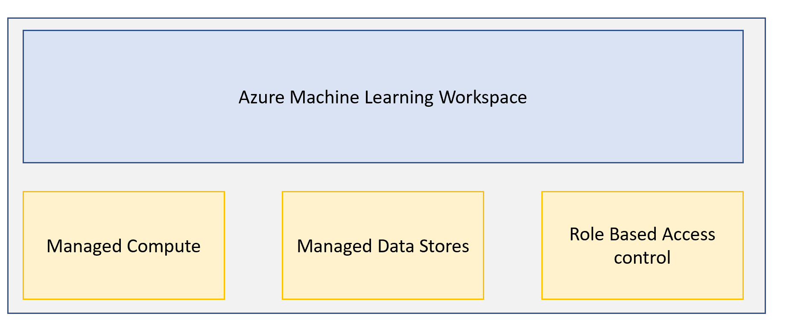

Within the Azure Machine Learning Workspace, there are three big decision to be made:

### Who has access to the workspace.

Best practice is to use Role Based Access Control, to grand user access to the workspace. There are three
roles available in AML, as in many Azure services, owner, contributor and reader. This is an overview of
the standard roles:

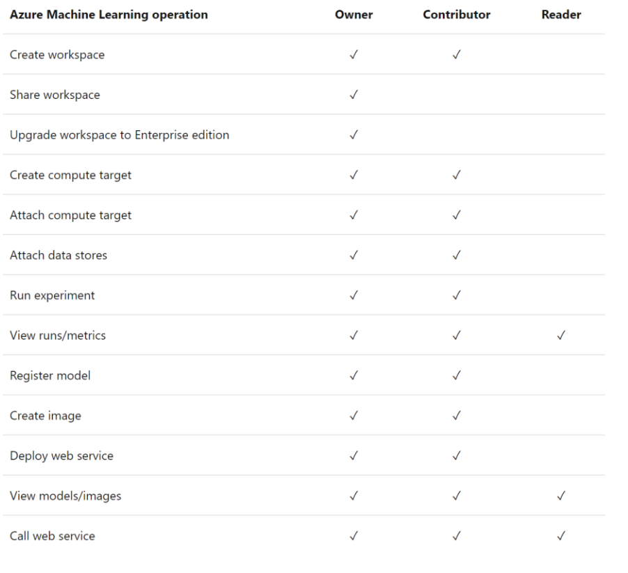

What we have learned from enterprise organizations, is that these standard roles do not suffice in most enterprise scenarios. A Data Scientist working in the Machine Learning workspace should be a contributor, so he/she can run experiments, create images, attach compute to a run and connect to the data stores. But as a standard contributor, the Data Scientist is also able to create compute, create workspaces and deploy models. In most enterprise scenario’s, for security/management and cost reason, the Data Scientists are not allowed to
create their own workspaces or compute. And is most scenario’s you only want to be able to deploy
models via Azure DevOps, where is will follow the standard dev practices of dev/test and prod environments and model CI/CD. Within Azure Machine Learning you can cerate your own custom roles.
Custom roles can have read, write, or delete permissions on the workspace and on the compute
resource in that workspace. You can make the role available at a specific workspace level, a specific
resource-group level, or a specific subscription level. Best Practice is to not allow data scientist to create
new workspaces or compute but let them ask permission through the IT department.

### Data Configuration to the workspace

Within Azure Machine Learning, we can make connections to Datastores in Azure, for example, to a data
lake storage. Within Azure Machine Learning we can connect to multiple data sources. The
recommended usage of datastores and datasets we will discuss later. For now, it is good to notice that
everyone in the Azure Machine Learning workspace has access to the data that is connected to it.
Therefore, when deciding how many workspaces you are going to create, for what purposes and for
which usages, we would recommend to be the access to certain data the leading factor. What we have seen
at enterpises, is that they have a workspace for each solution in each location. This, because most data
is protected on a database level also per solution area and per geographical location. Because every
individual with access to the Azure ML workspace, has access to the datastores connected to the
workspace, it is very important for security reason that this is designed properly and before we start
deploying the infrastructure.

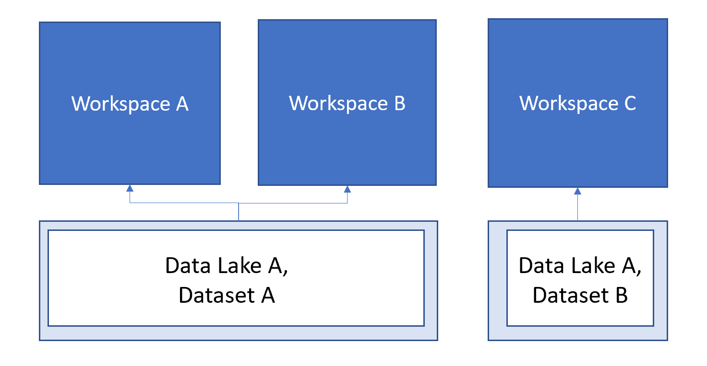

### Managed Compute Configuration
Within every workspace, you can make AML compute available for the users within the workspace. Every user within the workspace has access to all the compute. Therefore, it is also very important to think about the available compute within a workspace and how users may use these. What type of compute, how many cores and many different clusters you need in a workspace varies of course widely per scenario. Our advice would be to start with a minimum requirement of compute and scale out on request when needed. 

The compute needs change over time as a project evolves. What we have seen in practise, is that data science teams start with small, cheap compute clusters (1 or 2 cores) per user in the workspace, for quick experimentation and code development. When the code base is more mature, the teams switch to more compute to test distributed training. When the project gets more advanced, they might trade their many low cost compute for 1 or 2 clusters with more memory or GPU to scale their solution to the entire dataset or to allow their neural networks to get bigger. In the most mature stage, they might add a cluste rif multiple GPU's and distrubute their workload over multiple nodes. Schematic this might look like the following:

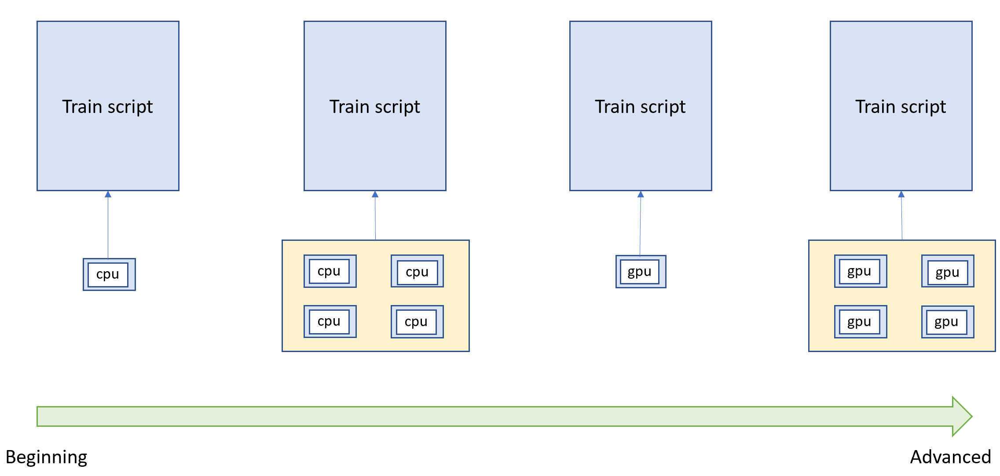

Best practise would be, that if you are in an experimentation phase of the project, you start with many small compute to speed up the development process, and move to more expensive compute with the optimized memory and runtime when scaling the solution.

## Shared resources across workspaces
To work with MLOps and Azure Machine Learning, we need some extra solutions. These solutions
include:
* ML Key Vault
* Application Insights
* Container Registry
* Workspace storage Account

Every workspace in AML can have their own recourses, but best practice is to share these resources across workspaces as showed in the following picture:

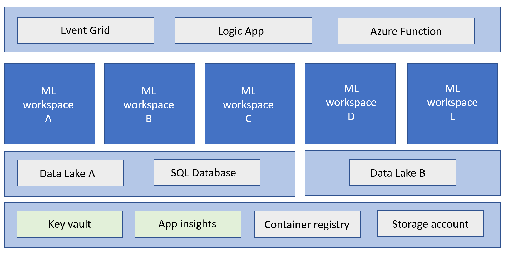

What we see most of my customers do, is that they create 1 Resource Group in Azure for Machine
Learning purposes per geo location. Within this resource group, they create multiple Azure Machine
Learning workspaces, all designed for different solutions. All these workspaces share the same resources
mentioned above. This way, you make it more accessible to share environment/models/metrics across
workspaces. They create a separate Resource Group for the management of the ML resources, because
this is mostly done from 1 place, where the management for all Azure resources happen.

By using Application Insights and Azure Key Vault across workspace, we create one place for the
management of all resources in Azure.

By using the default storage account across workspaces, users can easily share models as .pkl or .onnx
files, use common metrics, metadata or feature schemas.

We use Event grids, Azure functions and logic apps across workspace to put actions on events happening
in AML workspaces, like triggers when a job fails, or the filtering of certain logs.

By using container registry across workspaces, user can share and reuse already build environments.
This way you can lower the costs of container registry, limit the time waiting for new images being build
and promote the sharing of recourses. 

## Workspace organization
We have already discussed this a bit int the previous sections, but as a summary, it is best practise to
create workspace according to the access level of data. Because every user in the workspace has access
to all the data that is in the workspace, it is most advisable to have only projects that require
similar data use the same workspace. This is of course completely dependent on the security
requirements of the company. It always in the best interest of the project if data scientist
can have access to as much data that is possible and needed. But, especially in enterprise organizations,
limiting the access to data is important and should be leading in designing the infrastructure:

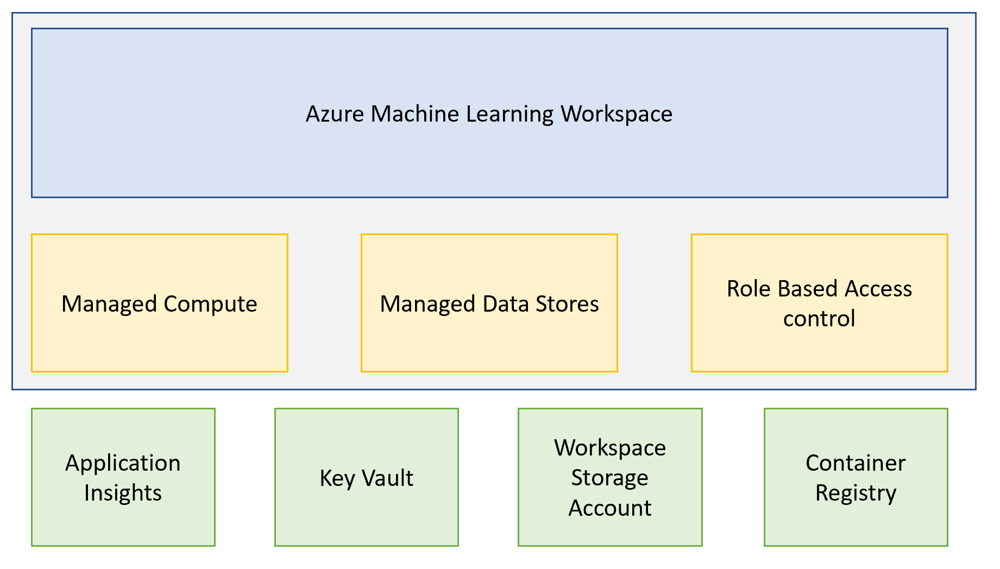

## Infrastructure deployment
As it is with all resources that we deploy in Azure, it is always bets practice to use ARM templates.
Moreover it is always bets practice to work with multiple environment when deploying solutions. 

As we can see from this picture, it is best practice to work with DEV, TEST and PRD environment. Similar
to normal DevOps practices, we allow only changes in the PRD environment through Azure DevOps.
What we also see in this picture, is that we have multiple release cycles within the ML lifecycle, namely:
- ML workspace and infrastructure deployment
- Model deployment
- Pipeline deployment

For now, we will focus on the infrastructure deployment, and later in this document we will focus on the
model and pipeline deployment.

Changes in the infrastructure are made in dev. These changes can be anything from provisioning new
compute to an AML workspace or attaching a new Datastore to an AML workspace to changing the
Azure Data Factory Pipeline or adding new Data Transformation Pipelines in Azure Databricks.
Best practice is to have the infrastructure of the whole ML project owned by IT. It is very important that
the infrastructure is managed in one place as all PaaS solutions relate to each other. For example, the
data science team expects data to come in a certain format. If the data engineer changes the data
format in Azure Databricks, the solution can potentially break.

## Infrastructure as a code
Azure Resource Manager (ARM) templates & Azure ML CLI commands can easily be used to bootstrap
and provision workspaces for your data scientists prior to enabling them to begin data preparation &
model training. The ARM template for deploying the AML workspace will look like this:

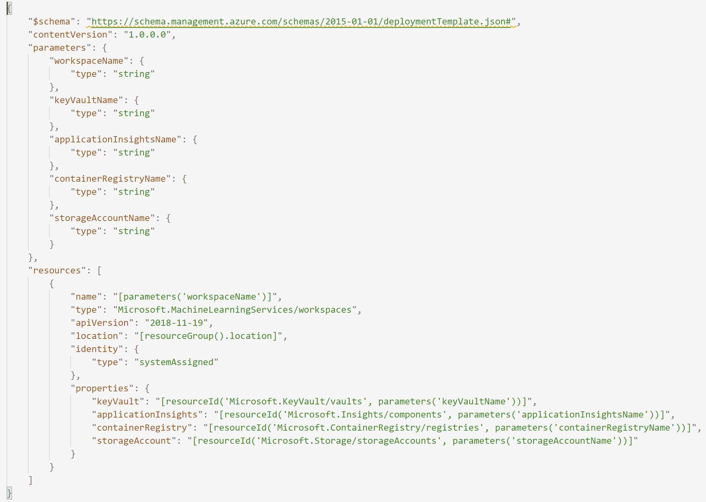

For all samples and to get started, follow the instructions [here](https://github.com/miquelladeboer/aml-mlops-workshop/tree/master/infrastructure)

In this folder you will learn about how you could use [Azure Pipelines](https://azure.microsoft.com/en-us/services/devops/pipelines/) for the automated deployment of infrastructure. This way of working enables you to incrementally deploy changes to your resources, stage the changes over different environments, and build confidence as your system growths more complex.

### Best practices on customizing the templates for your environment and team

* Many teams already have existing resources in their Azure tenant for e.g. Keyvault and Application Insights. These resources can be re-used by Azure Machine Learning. Simply point to these resources in the [Machine Learning Workspace template](arm-templates/mlworkspace/template.json). For ease of modification, we have provided separate templates for each of the resources in this repository.
* In most situations data already resides on existing storage in Azure. The [Azure CLI ML Extension](https://docs.microsoft.com/en-us/azure/machine-learning/reference-azure-machine-learning-cli) allows for a lean way to add storage as a [Datastore](https://docs.microsoft.com/en-us/azure/machine-learning/concept-data) in Azure Machine Learning. The [Azure CLI task](https://docs.microsoft.com/en-us/azure/devops/pipelines/tasks/deploy/azure-cli?view=azure-devops) in Azure DevOps can help you to automate the datastore attachment process as part of the infrastructure roll out.  
* Many teams choose to deploy multiple environments to work with, for example DEV, INT and PROD. In this way infrastructure can be rolled out in a phased way and with more confidence as your system becomes more complex.
* As one rolls out additional infrastructural resources, it becomes valuable to stage changes across the different environments. You could consider to run a set of integration or component tests before rolling out to PRD.
* It is a sound practice to protect the roll out of changes to PRD from originating from branches other than master. [Conditions](https://docs.microsoft.com/en-us/azure/devops/pipelines/process/conditions?view=azure-devops&tabs=yaml) in Azure pipelines can you help to set controls like these.
* One could specify a security group of users that require to give their [approval](https://docs.microsoft.com/en-us/azure/devops/pipelines/process/approvals?view=azure-devops&tabs=check-pass#approvals) to make roll outs to specific environments.
* It is important to note that in the MLOps way of working, we make a separation of concerns between the roll out of infrastructure and the roll out of ML artifacts. Hence the two types are rolled out at different moments and with different automation pipelines.
* Multiple additional security controls (virtual network rules, role-based access control and custom identities) can be applied on the Azure resources that are found in this repository. Controls can be added directly from the ARM templates. Consult the [documentation](https://docs.microsoft.com/en-us/azure/templates/) on Azure Resource Manager to find the possible modifications that can be made to each Azure Resource. As an example on modifications for the template for Azure ML compute, one can find a [template](arm-templates/mlcompute/template-vnet.json) in this repository that adds a SSH user and virtual network controls to the managed compute virtual machines.

## Dev Tools and project management
For applying ML at scale, there are a couple of dev tools that I would recommend using when designing
your solution. I will share what I believe are the best tools to use. Then we will discuss some project
management and templates for set-up that I believe are important for project management and for
speeding up machine learning model roll out.
Before I start with the development tools, I think it is good to mention that designing machine learning
models in the cloud and at scale requires different skills than standard data science projects. The
following diagram shows all the different component in the ML lifecycle:

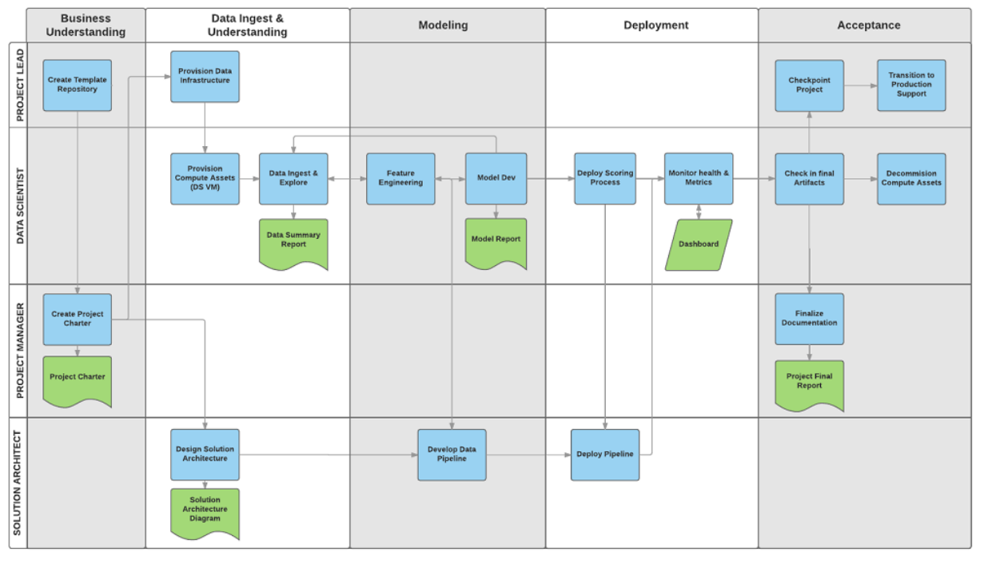

As you can see from this picture, a data scientist is expected to do more than just experimenting with
machine learning models. He/she needs to create connections to cloud data, create reports, do feature 
engineering, model deployment, dashboarding and create health checks. Mostly, the data scientist is
not alone in this and the different parts of this process can be divided across different people with
different skillsets, but it still requires much more software engineering skills and DevOps practices.

### Development tools
What we have seen a lot at data science teams that are new to either cloud development or ML at scale is that
most of their data science work is done on local machines, using notebooks. This approach is of course
not feasible if we want to produce ML at scale. 

Firstly, we would strongly recommend to not use notebook
when developing ML models. Notebooks can be useful to explore the data, as the interface is designed
to easily plot data and execute code in pieces. However, notebooks lack a lot of tools that we believe data
scientist should use. For example, with notebooks it is not possible to do proper code testing using
Flake8. Moreover, it is not possible to have proper environment management. The importance and how
to do environment management we will discuss later. It is also not possible to include unit and
integration test in notebooks. We would therefore recommend to use:
* VSCode as development tool for ML models. (Note that it is possible to use .ipynb files in VScode for data exploration for example. An example of this can be found [here]( https://github.com/miquelladeboer/aml-mlopsworkshop/blob/master/code/data/data_exploration.ipynb).)
* Git for collaborative coding. If you are new to git, I would recommend to read the [this](https://docs.microsoft.com/en-us/azure/machinelearning/team-data-science-process/collaborative-coding-with-git) article.
* Azure DevOps for project management, code management, model CI/CD, infradeployment.
* Azure data explorer. Azure data explorer is a tool to explore data in blob storage or Azure Data Lake.
* Miniconda. Miniconda is a free minimal installer for conda. It is a small, bootstrap version of Anaconda that includes only conda, Python, the packages they depend on, and a small number of other useful packages, including pip, zlib and a few others. You can use miniconda to create separate virtual environments. This makes the management of different environments easier.
* Azure Cli. The Azure cli is used to remotely connect to azure. This tool makes the cloud developmenteasier.
* Flake8. Flake8 is a tool thatis highly recommended for writing code of good quality. This tool is used by software engineers and is a great to check the code quality.

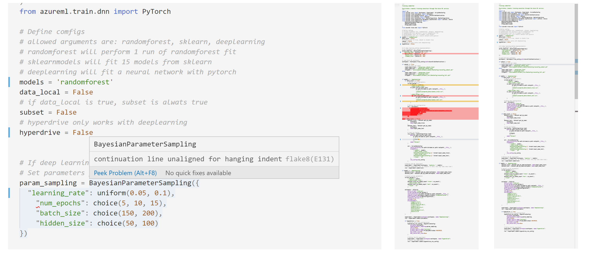

### Project management
Having all projects share a directory structure and use templates for project documents makes it easy
for the team members to find information about their projects. All code and documents are stored in a
version control system (VCS) like Git, TFS, or Subversion to enable team collaboration. Tracking tasks and
features in an agile project tracking system like Jira, Rally, and Azure DevOps allows closer tracking of
the code for individual features. Such tracking also enables teams to obtain better cost estimates. I 
would recommend creating a separate repository for each project on the VCS for versioning,
information security, and collaboration. The standardized structure for all projects helps build
institutional knowledge across the organization.
We provide templates for the folder structure and required documents in standard locations. This folder
structure organizes the files that contain code for data exploration and feature extraction, and that
record model iterations. These templates make it easier for team members to understand work done by
others and to add new members to teams. It is easy to view and update document templates in
markdown format. Use templates to provide checklists with key questions for each project to ensure
that the problem is well defined and that deliverables meet the quality expected. Examples include:
* a project charter to document the business problem and scope of the project
* data reports to document the structure and statistics of the raw data
* model reports to document the derived features
* model performance metrics such as ROC curves or MSE

But also uses folder structures for code development, infrastructure, environments, and testing. A
typical folder structure will look similar to this:

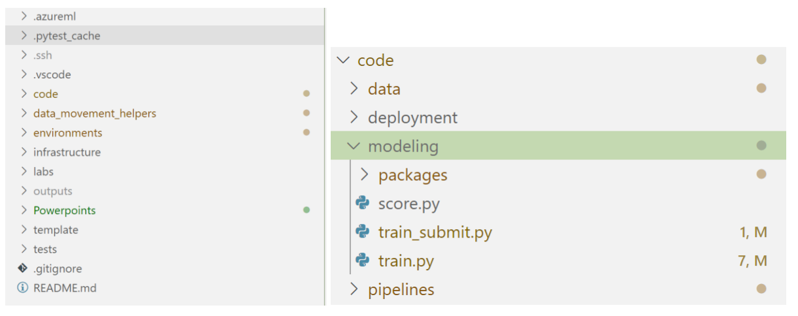

Where we have folders for:
* code
* environments
* infrastructure
* helpers (azure infra)
* tests

And within code we have structures for:
* data preparation
* modeling (train, train submit, scoring)
* Machine Learning Pipelines

## Choosing the right compute target.
Azure ML offers different types of compute for different usages. The picture below gives you an
overview of the different types of compute.

### Compute instance
AML offers compute instances for code development. These VM are notebook based and contain all
common packages used by data scientist. These Compute Instances are an easy way to demo or get
started with AML, but in my opinion, these compute instances are not designed for ML at scale. For code
development I would recommend using VScode either on local machines or within Virtual Machines.
You could opt for local machines, because this is the cheapest solution. However, local machines might
not be sufficient for certain memory and RAM requirements. Moreover, it might not be following
company guidelines, as data needs to reside on the local machine. The second option is to use Virtual
Machines to work in. This is the most save way and allows you to choose the right VM size. However,
there are logically cost associated with VM’s. An even more comprehensive solution is to use Data
Science Virtual Machines. These machines include all tools and framework data scientist need. This way,
you do not lose any time to set up environments, you can make sure all data scientist use the same tools
and frameworks and you can easily scale out the solution. Everything that is included in the DSVM can
be found here:
https://azuremarketplace.microsoft.com/nl-nl/marketplace/apps/microsoft-dsvm.dsvm-win2019?tab=Overview
We would recommend going with DSVM’s if cost are not a constraint. Otherwise, develpoing locally is a good altertative if requirement allow for this.

### Training cluster
AML offers different types of training clusters. The biggest difference between the compute instances
and training cluster is, is that we can turn on and off training compute on demand, whereas the
compute instances are always on.
The following types are available in AML:

As we can see DSVM’s and AML compute are the only compute targets that support all solutions.
Therefore, I would recommend to use either of these computes.
If you are already using DSVM’s for code development, it is very cost efficient to use the same compute
for model training because you are already paying for that compute. However, certain model training
might not fit on the VM compute. Moreover, certain jobs of the data science lifecycle might have better
performance on certain types of compute and some models perform best on certain runtimes that are
optimized for certain computes. In this case me might want to use Azure ML compute, that we only spin
on to execute a certain job and then put it off until the next job. Let illustrate this with an example.

For example, I use my DSVM for code development. To try if certain parts of my code work, I use my
‘local’ compute to execute parts of the code with only a subset of the data. Once I am more advanced in
my work, I want to apply my code on the full data set. My code contains several different steps that I
can execute separately for different purposes. I have a data engineering script to perform some data
transformations on the dataset. I am using pandas, so I am not able to distribute my executions over
multiple nodes. But I do have a lot of data. Therefore, I will use a memory optimized CPU cluster with 1
node for data engineering. In the experimentation phase I found that I wanted to use a neural network
for training my model. However, I first need to figure out the hyperparameters that I want to use. In this
case I want to use a subset of my data and perform 100 simultaneous runs with different
hyperparameters to find the best. In this case I might use a cluster with less memory as the previous
one, but with 20 or even 100 nodes in the cluster, so I can parallelize the jobs. Now that I have found my
optimized hyperparameters, I want to train my model with the full dataset. As I am training a neural
network with a lot of data I might want to opt for using a GPU cluster. As distributing a neural network
across nodes is hard (but not impossible!), I will only use 1 node in my cluster again. This way, I have
optimized my training process across different computes and then I only pay for the compute when I
need it.

### Inference cluster
The inference cluster is being used for the deployment of models. For inferencing, we have the following
compute options:

At the time of writing, only ACI and AKS are in GA and since we are discussing enterprise solutions, I
assume that only GA product can be used.

As stated in the picture above, ACI is used for testing and development of machine learning models.
With ACI you get one instance. AKS is the same as ACI, but with AKS you can create multiple instances
and scale out and in when needed. Therefore, AKS is a recommended compute for model inferencing.

### Attached compute
You have option to bring your own compute to AML. I sometimes see that customers bring there own
AKS clusters to the service, because they already have their own to reduce cost. But, I would
recommend to use the clusters from Azure ML if you do not have them, as it is easier to let the service
mange your clusters.

## Managing environments

When developing ML models at scale, it is very important to manage your conda environment correctly. Especially if you are working with multiple people on the same projects. It is even more important to manage your conda environment during local training as you will need the exact environment when training on a AML cluster or when you deploy your model for inferencing. The solution might fail if you use a different version a certain package. 
It is also very important to work in a structured way when managing these environments. Especially if the project grows larger and when you add more steps to the solution, you might want to use different environments for different parts of the solution. To go back to the example I gave during ‘choosing the right compute’, I might have for the same steps different environments. For example, if we are preparing the data, I might use libraries as Dask or Fastparquet, whereas in model training I might need a Pytorch framework or onnx runtime. 

## Run configurations
If we combine the different environment, different datasets, and different compute together with the different training scripts, I can create a configuration file. This configuration file will sent an experiment to the AML service as explained in the following picture:
 
 By using different models, different environment, different compute or different data, we can create different run configuration files that will result in different experiments:
  
  As we have seen from the example, certain data, compute, environments, and models result in a specific run configuration for different steps of the training. I would recommend storing these run configurations in a structured matter, so it is easier to reuse and share across the organization. This will help you with speeding up the process of development. An example in your code base could look like this:
  
  Where I have different YAML files within every environment, like the one for a neural network.
Best practise is to create YAML files for your run configuration. Azure DevOps pipelines has chosen the direction of working with YAML files for building pipelines. It is therefore recommended to also build the Azure Machine Learning pipelines and configurations with YAML. . An example of the pipeline could look
like the following:

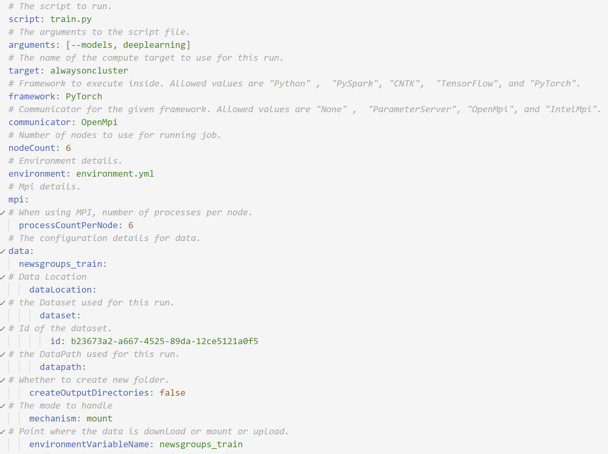

###  Private PyPI packages
For security reasons, I see some companies (mostly in financial services) use only private packages or
packages that have been validated. This is to make sure that if public packages are used, there is no
leakage of data for example. If you choose to do so, you can easily upload your private wheels to the
storage account of AML and use your private packages for model training and deployment.

## Data management (datasets)
We have already discussed how we can connect our AML to a storage account. But what I see at most
customers, is that they add an extra layer on top of the datastores. This layer is called a dataset.

I will briefly explain the concept and need for datasets. In many cases, a datastore, like a blob storage
will receive new data every hour/day/week or so, so data in constantly streaming in. However, when
creating a ML model, we usually take a snapshot of the data for training the model, and we only retrain
the model every week/month/when triggered. Therefore, the data that is used for training the model, is
not consistent with the data that is in datastore. Datasets is a concept that is in essence a metadata
framework about the data used in training. When using datasets, you can specify exactly the data used
for training and keep track of multiple versions of your dataset. In this way you have full lineage of the
data used in training. This can be very useful when question arise about bias and transparency. I would
highly recommend to make use of datasets when using AML for training you model. Datasets in AML look like this:

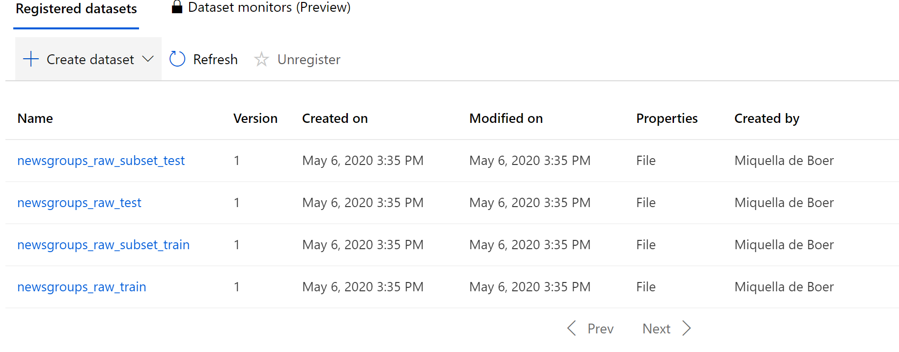

### Data exploration and validation
Before starting an ML experiment, we need of course to explore and validate data. As I have already
mentioned, we can use notebooks, even within vscode, to perform our data exploration. 
An very important part of MLOps is data validation and data validation over time. We want to make sure
if we automate the process of re-training that our data is not drifting (or at least we want to be aware of
drifts) and that the data is not biased. More basic validation like if the format of the data is still as
expected or if there are any missing values present are also important to validate.

We understand why bias is bad for model training, but I think it is important to point out why data
drifting is important to be aware of. Of course, data drifting is not necessary a bad thing. It is something
that we are expecting. That is also part of the reason why we retrain our model occasionally, to reflect
the new incoming data as well. However, what I see at most customers, is that the have model
validation after they trained the model. Within model validation, customers often check if certain
parameter are within a certain bandwidth. When this happens, the model validation will fail. However,
as we can imagine, if the data changes a lot, these parameters are expected to go out of bandwidth. As I
do recommend to let you model fail when this happens, it is recommended to have a data profiling
report ready that can explain these failures.

Therefore, I would recommend to build a baseline profile of basic and more advanced statistics of your
dataset, that you found when exploring the data, and every time you retrain your model, validate if your
new data is within a certain interval of these statistics. I would recommend building a small report of
warning and output this to the blob storage. I would also recommend to build a small dataset of all
these statistics over time. This way, you can you Power BI for example, to create reports and profiles of
your data and check and guarantee data quality and transparency. Here is an example of folder
structures for examining data:

## Data preparation
Data engineering is a big part of the Data Science lifecycle. In many cases, a lot of the data preparation is done by the data engineer. However, for the ML purpose
the data still needs to be transformed for better and logical model results (logs, abs values, etc..), new
features need to be created, categories need to be one-hot-encoded or data need to be indexed. All
these steps are ML model specific. So common question that enterprises have is where to perform data engineering and who is the owner of this part. It is our recommendation that the data preperation that is specific for the Data Science project is always in the ownership of the Data Science Project. This can still mean that the Data engineer will develop the data engineering, but only that it is part of the project.

### Small datasets
In the case of small datasets, it is best to perform data preperation and model training on the same compute. As the dataset is small, this could be local compute or the ocmpute of a DSVM. This can also be AML compute for remote execution and pipeline execution. 

  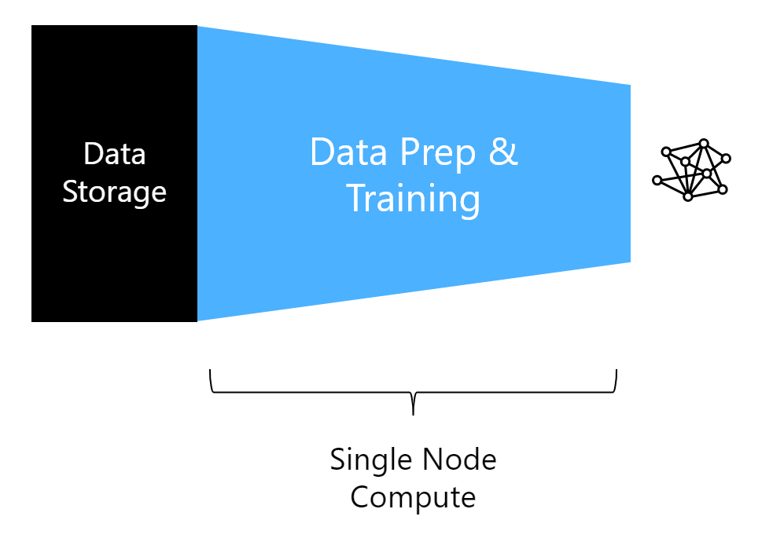

### Big datasets
When the data is growing, we need a solution that scales to better/faster compute. In this case it is recommended to split the data preperation and model training across different computes. As we have discussed in the environments section, data preperation and model training require different conda environments, but also diffrent types of compute. For example, the data preparation might be highly parralizable on many nodes, whereas the training of a certain network is way harder and not as benaficial to train across nodes, but would benefit from extra ram to fit the model parameters.

In this scenario it would make sense to perform data preperation on multi-node compute in Azure Machine Learning and perform model training on a different AML compute (can still be multi-node).

  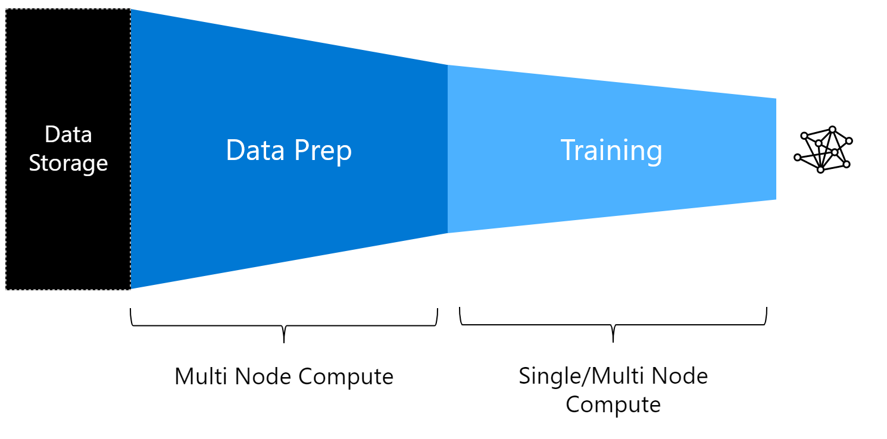

### Bigger dataset
When the data exceeds a TerraByte of data, we might need to opt for even bigger compute when doing the data preparation. In the case of have more than a TerraByte of data, it might be interesting to do data preperation on sprak compute. Apache Spark is a parallel processing framework that supports in-memory processing to boost the performance of big-data analytic applications. On Azure, there are two ways that you could run your scripts on Spark:
* Databricks
* Spark on HDInsight

Both have the pros and cons. Here is a short list on the different requirement you can have and when to opt for one or the other:

  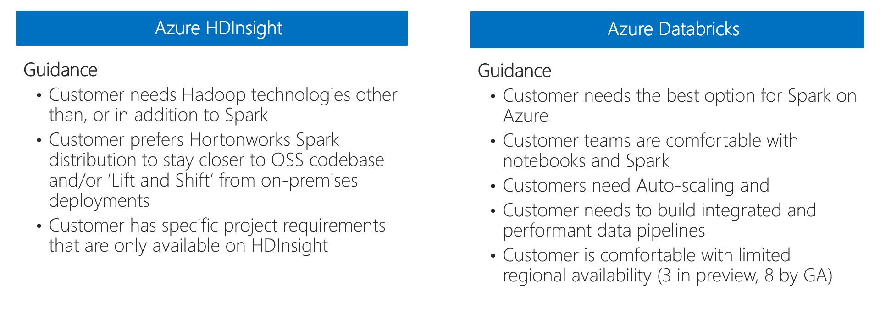

Another option would be to run Dask on Azure ML. Dask provides advanced parallelism for analytics, enabling performance at scale. Dask's schedulers scale to thousand-node clusters. Dask uses existing Python APIs and data structures to make it easy to switch between Numpy, Pandas, Scikit-learn to their Dask-powered equivalents.

In the case of this "Bigger" compute, we can split the job over three types of compute: 
* Perform the heavy data tranformations on Spark Compute
* Perform model specific, less heavy transformations on AML Compute
* Perform model training on AML compute

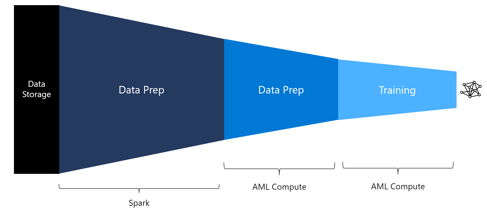

## Model development
During model development, it is important to log all training runs against AML. AML helps you with
tracking experiments, logging metrics and graphs. I would also recommend to use proper tagging and
naming and design these before starting to experiment. Especially tagging can help you a lot with then
management of the models.

## Model validation
Just as important as the data validation, is the model validation. Before we can register and even deploy
a model, we need to validate if the model is outputting the right results, expected metrics and can
handle new data. It is always recommended to use cross-validation during training, but I would always
advise to validate the model with new incoming data.
Similar to data validation, with model validation, you might want to create a report to keep track of all
the model specifics like metrics, parameters, expected bandwidth etc.. and output this in the blob
storage for visualizing and monitoring model performance in a Power BI dashboard.

During model validation, we are also going to create a scoring file. Contrary to what is stated in the
document I would strongly advise you to always develop and deploy your scoring file together with the
model. This includes preprocessing and postprocessing.

## Pipeline development
Throughout this document we have discussed different part of the ML lifecycle before we actually have a model, including data validation, data preparation, model experimentation, hyper tuning and model training. Instead of having all these loose parts, we want to create a pipeline that can execute all these steps sequentially. Moreover, the output of one step needs to be the input of the next step. For example, in the step of data preparation, the input is data and the output is prepared data. We want to take the output of prepared data and use that as input for model experimentation. As explained in this picture:

As discussed in previous topics, each of these steps need to be able to run with their own data and on their own compute and with their own conda environments. The tool to use here is AML pipelines. For more information on the concept of pipelines: https://docs.microsoft.com/en-us/azure/machine-learning/concept-ml-pipelines
What I see at most customers, is that AML pipelines are not designed by the data scientist. The data scientists focus mostly on creating the scripts that need to be executed in the pipeline. Mostly, the development of pipelines is done by the ML engineers. I would also recommend if you have the capacity to divide the work in this way. The development of pipelines involves more software engineering skills.
It is possible to create your ML models with azure machine learning pipelines. An example is shown here:

## Model and pipeline deployment

As already discussed in the document, a big part of MLOps is the automated deployment of machine
learning models. In here we use standard DevOps practices applied to ML. When deploying ML models,
we have in many case actually two deployment cycles:
1. Deployment of the model
2. Deployment of the pipeline

The interested part will happen when the automated pipeline will generate a model, but we will discuss
this later.

### Model CI / Pipeline CI
A very important process of automated deployment is CI. Continuous Integration (CI) is the process of
automating the build and testing of code every time a team member commits changes to version
control. CI encourages developers to share their code and unit tests by merging their changes into a
shared version control repository after every small task completion. Committing code triggers an
automated build system to grab the latest code from the shared repository and to build, test, and
validate the full master branch (also known as the trunk or main) - What is CI?.

It is a good practice to set up continuous integration for a machine learning model to get continuous
feedback on the product quality. In practice, some tasks may be required to run less frequently than
others (e.g. the training of a ML model). Therefore, we distinct between different CI processes triggered
by either feature branches or the master branch.

### Testing
This phase includes code testing with unit test and integration test. These tests are part of our code
base. The recommended way is to add your test to the code section where also your data
exploration/preparation, modeling and pipeline creation resides.

Within this test folder, we want to create multiple folders for different parts of testing. We want to unit
test our train.py code in modeling, perform model validation and also validate the scoring function of
the model. Below is a recommended structured way of organizing test folders and an example framework for testing.

