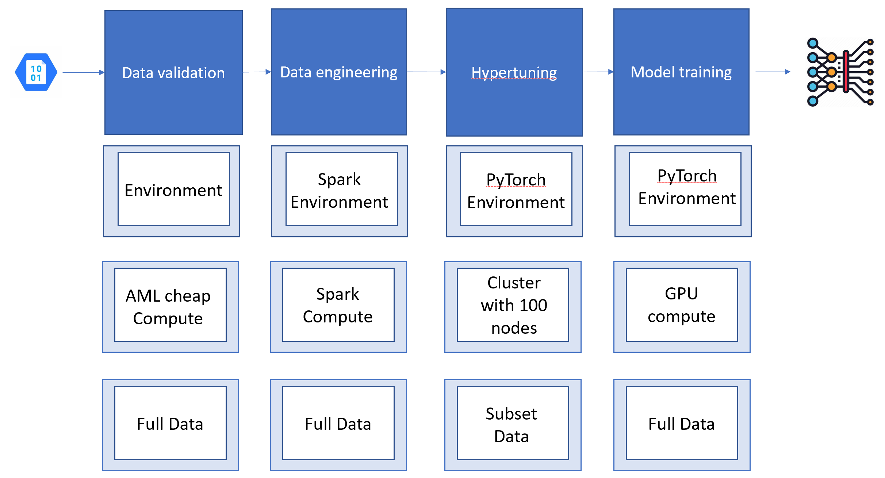
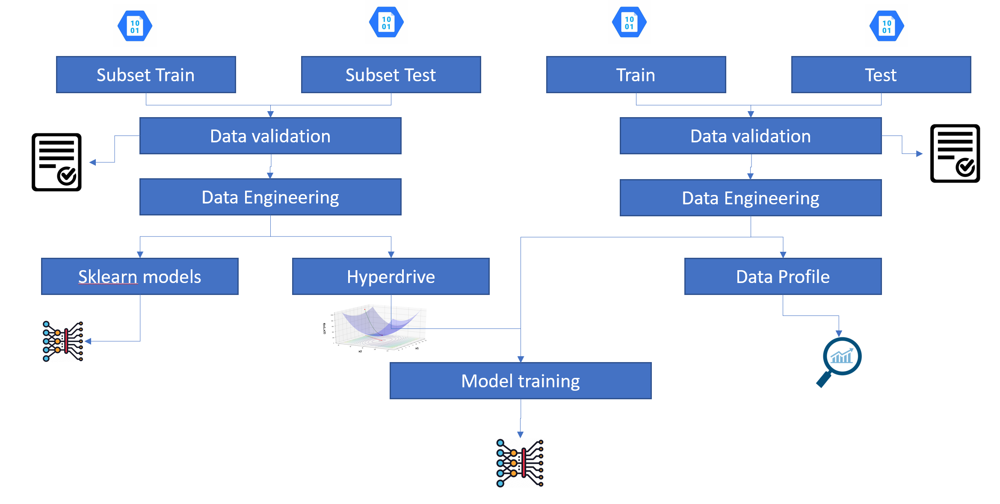
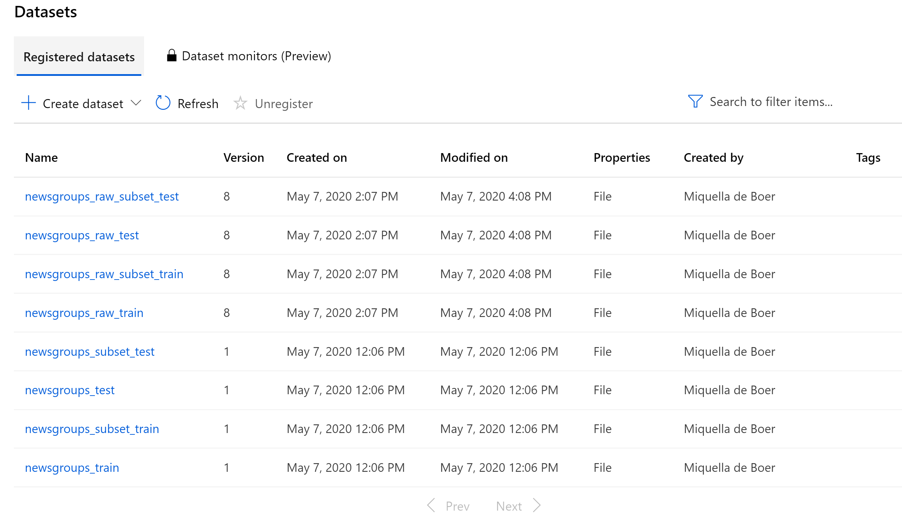
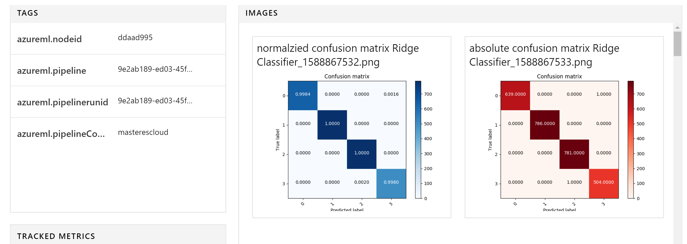
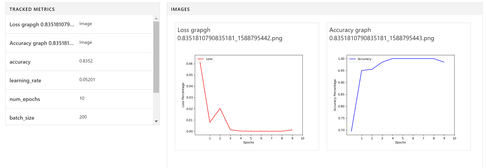
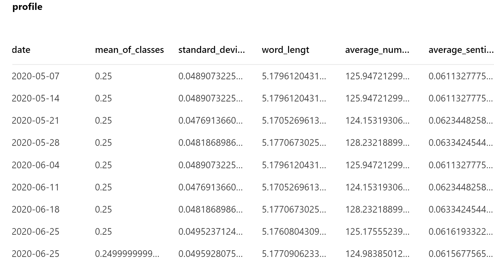
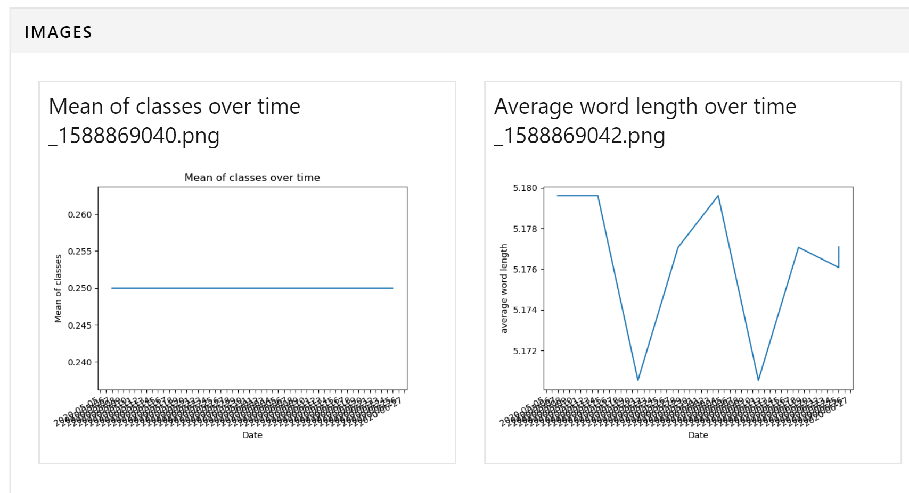
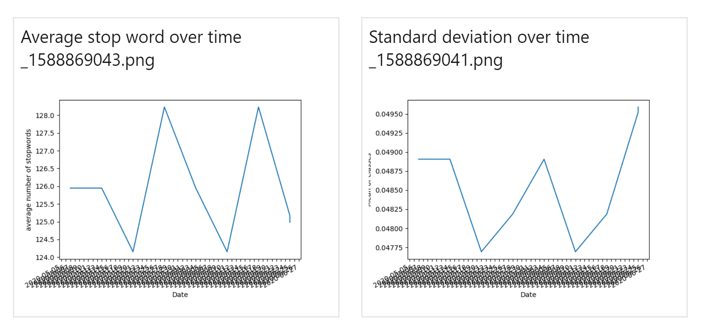
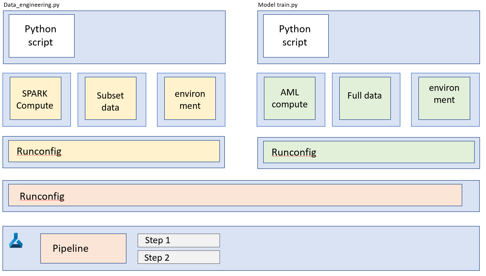

# Pipelines
For every script i the pipeline, we will use different compute that is optimized for that specific task. For different types of model training, we will also use different types of data as some training is so heavy, we consider only using a subset to accelerate the training process. Every step in the pipeline will also have its owen evnironment file, this environment file contains specific conda dependecies that are specific to the task it needs to perform. For example, data engineering will be done using packages like Dask or Numpy, where for modeling sklearn models we need of course SKlearn environment. For performing deep learning we even need a PyTorch Frameworl. For the use and nessecety of using different environment I would refer to the `environments/README.md` file in this repo. A High level overview of the steps we are going to take and the different data/compute and conda environments is shown in this picture:

A more detailed version of what we are going to do is the following:
* data validation of the four different datasets 
* data preparation of the four different datasets
* explore different sklearn models on subset of the data
* perform hyperparameter tuning on subset of the data
* use the hyperparamters from tuning to train the full neural network on the entire dataset
* create a profile with statistics of the entire dataset to track data over time.

These steps are shown in the following diagram:

In this folder we have created a pipeline including all the steps that we have discussed in this example. If we incorporate the dataset creation and all the different environment files from the explenation above, we will end up with the following pipeline in Azure ML:

The steps that we perform in the pipeline are as follows:
## datatset creation

When new data came in, the pipeline was triggered. Now we want to create a new version of the dataset by running the `define_new_dataset` step in the pipeline. This way, we know exactly which data is used during the model creation in the pipeline. After this step, we expect the following output it the portal:

    

## Data validation

The second step is to validate the data. We do this for the train and test dataset and for the subsets of both. So in total we will validate 4 different datasets. We validate our data against a baseline profile. The baseline profile is a profile with statistics of our dataset that we manage manualy. The profile resites in the blob storage, so we can use that as a pipeline data input too. The basline we can visualize in our Power Bi report for monitoring, togerther with the historic profil and model management data. The baseline data wil look similar to:

The output of the data validation can be two things. There was either something wrong with the data that created an error, like unexpected data types or non values or if the language of the data is still English or the data validation passed and it created a summary report that indicates that their might be some data drifting. In this example we looked at the bias of classes and some basic text statistics like average sentiment or average lenght of words. The summary report will look similar to:

    

This data is also outputted to the blob storage, so can also be used later for reporting in Power BI.

## Data engineering

The thrid step is the transformation of data. In this step we will clean the text data and perform steps like making text lower case, remove punctuation, numbers and special characters. We will also remove any stop words. The output of this step is a clean dataset that is ready for training.

## SKlearn models

In the fourth step, we will peform 15 different sklearn models on the data from the sklearn packages, including randomforeser, naive bayes and Ridge classifier. A full overview of the models being trained, can be founs in the `class Model_choice` on the `sklearn.py` package under `packages`. Comparing different algorithms is possible is different ways. We could submit a new experiment for every algorithm that we try. However, Azure ML offers a better, easier way to manage the exploration of multiple models. This concept is called child runs.  We are going to make use of these child runs. For every of the 15 algoritms that we have we want to create a sub run and log the metrics seprately. Whihin the child run we are going to log the performane and the model .pkl files. This way we can easily track and compare our experiment in Azure ML. If we run this file, the output will look like the following:

    
    

## Hyperparameter tuning

In the fith step we will perform the hyperparameter tuning. We will perform this step only on a subset of the data, as hypertuning is a very heavy job. We will try maybe 100 different hyperparamter pairs. To save time, we therefore only use a subset for training and use a cluster with many nodes, so we can perform part of the job simultaniously. The output of this step will me the hyperparameters of the best model. We will use these hyper parameters in the next step, to train the full model. Some output of the hyperparameter steps are:

    
       

All hyperparameters from all child runs are also saved to blob for reporting purposes.

## full model

In the sixt step, we are going to train the full model with the hyperparamters from the previous step. This we will do on a GPU that is memory optimized. This step will output the final model in onnx format, that will be registered to Azure Machine Learning. We have already created the scoring app that corresponds to this model, si after this step, the model is ready for deployment. The output of this step will look like:

    

## historic profile of data

For reporting purposes, detecting data drift and for a better understanding of our data, we keep a historic profile of our data every time we retrain our model. This histroric profile is created from the full dataset and stored in bobstorage for reporting purposes in Power BI. Note to not confuse this profile with the baseline profile. The baseline profile is manually designed and picked to validate the data. The historic profile is part of a autonomized process that is only used for looking back. The output from this step will look like:

   
   
   

# Pipeline Development

Throughout this document we have discussed different part of the ML lifecycle before we actually have a model, including data validation, data preparation, model experimentation, hyper tuning and model training. Instead of having all these loose parts, we want to create a pipeline that can execute all these steps sequentially. Moreover, the output of one step needs to be the input of the next step. For example, in the step of data preparation, the input is data and the output is prepared data. We want to take the output of prepared data and use that as input for model experimentation. As explained in this picture:

As discussed in previous topics, each of these steps need to be able to run with their own data and on their own compute and with their own conda environments. The tool to use here is AML pipelines. For more information on the concept of pipelines: https://docs.microsoft.com/en-us/azure/machine-learning/concept-ml-pipelines
What I see at most customers, is that AML pipelines are not designed by the data scientist. The data scientists focus mostly on creating the scripts that need to be executed in the pipeline. Mostly, the development of pipelines is done by the ML engineers. I would also recommend if you have the capacity to divide the work in this way. The development of pipelines involves more software engineering skills.
It is possible to create your ML models with azure machine learning pipelines. However, I would recommend to use the machine learning extension from Azure DevOps to create your machine learning pipelines.

# Pipeline deployment

As already discussed in the document, a big part of MLOps is the automated deployment of machine learning models. In here we use standard DevOps practices applied to ML. When deploying ML models, we have in many case actually two deployment cycles:
1.	Deployment of the model
2.	Deployment of the pipeline
The interested part will happen when the automated pipeline will generate a model like this:

